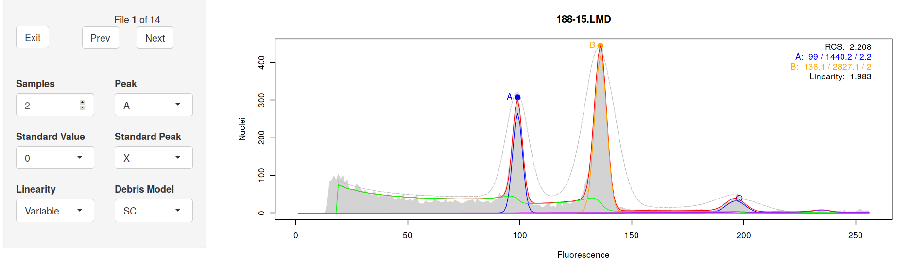
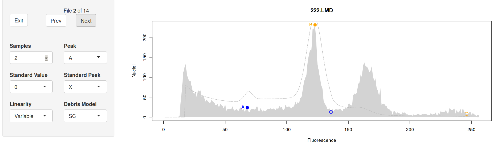
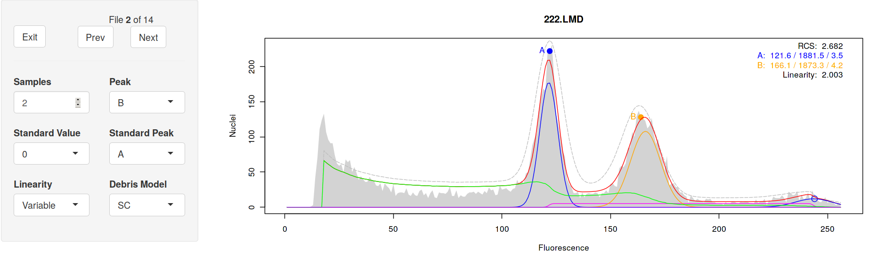
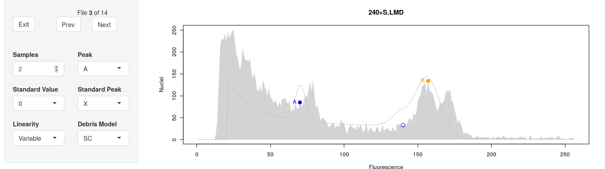
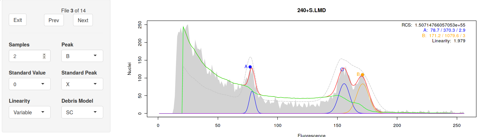
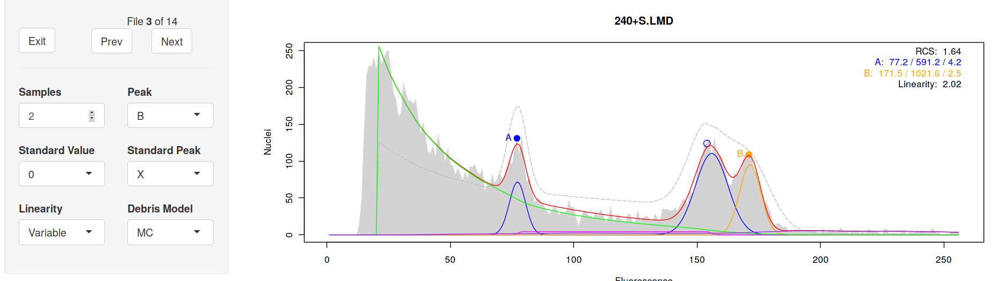
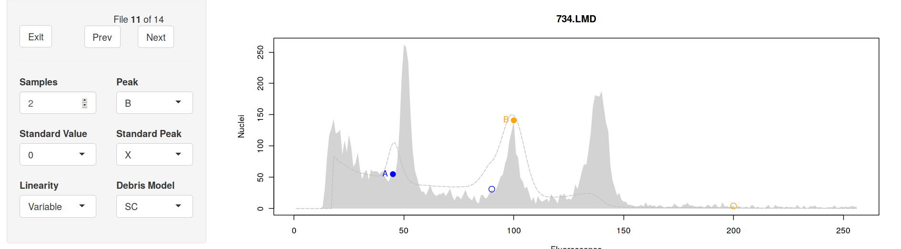
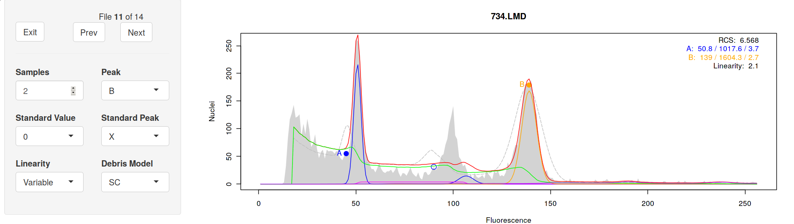
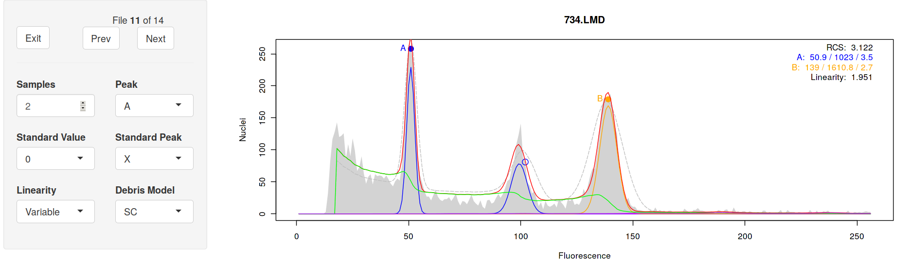

# Overview

This document provides a walk-through of the normal workflow for analyzing
flow cytometry (FCM) histograms with `flowPloidy`. See the vignette
"flowPloidy: Flow Cytometry Histograms" for an general overview of FCM
histograms.

# Installation
## Stable Release
`flowPloidy` is part of the [BioConductor](bioconductor.org) repository.
You can install the stable version of the package directly from there.
First, install `bioconductor` in your `R` session:

```{r bioconductor, eval=FALSE}
source("https://bioconductor.org/biocLite.R")
biocLite()
```

Then install `flowPloidy`:

```{r biocLite1, eval=FALSE}
biocLite("flowPloidy")
```

The examples in this vignette, and the `flowPloidy` help files, use data in
the `flowPloidyData` package, which is also on BioConductor. (You don't
need `flowPloidyData` to use `flowPloidy` on your own data, only for the
examples).

```{r biocLite2, eval=FALSE}
biocLite("flowPloidyData")
```

## Development Release

The Bioconductor system emphasizes stable packages. As a consequence,
updates are only released twice a year. At the moment (March, 2017),
`flowPloidy` development is proceeding at a faster rate. Consequently, you
may prefer to use the developmental version. This is available directly
from the [GitHub](github.com) repository, but requires a few more steps to
install.

First, you need to install `bioconductor`, if you haven't already:

```{r bioconductor2, eval=FALSE}
source("https://bioconductor.org/biocLite.R")
biocLite()
```
Next, you'll need to install two dependencies from `bioconductor`:

```{r bioc-dependencies, eval = FALSE}
biocLite("flowCore")
biocLite("flowPloidyData")
```

You also need the `devtools` package, if you don't have it already:

```{r devtools, eval = FALSE}
install.packages("devtools", dependencies = TRUE)
```

Now you can use `devtools` to import the latest version of `flowPloidy`
direct from the repository:

```{r github, eval = FALSE}
library("devtools")
install_github("plantarum/flowPloidy", dependencies = TRUE,
               build_vignettes = TRUE)
```

This *should* install `flowPloidy` along with all its dependencies.
However, sometimes R gets confused and will complain about missing
packages, even though we've asked it to automatically install everything
that `flowPloidy` needs (i.e., `dependencies = TRUE`). If you see messages
in the terminal indicating a package name that isn't found, try installing
that package directly and then re-run the `install_github` line above.


# Importing Data
Once you have the package installed, you're ready to process your files.
You can load single files, but we usually process a directory-full of FCM
files at once. For the purposes of this tutorial, we'll use the sample
files provided in the `flowPloidyData` package, which we installed in the
previous section.

```{r flowPloidyData}
library(flowPloidyData)
```

After loading this package, you'll have access to the variable
`flowPloidyFiles`. This is a vector containing the full paths to the sample
data files on your system. Whenever we use it in the examples below, you
can substitute a list containing the paths to your FCM data files.
Subsetting this variable (i.e., `flowPloidyFiles[1]`) produces a single
file name.

Before we can load our flow data, we need to know which channel to use for
our histogram. We can see a list of all channel names with the function
`viewFlowChannels`:

```{r viewFlowChannel, output = "hold"}
viewFlowChannels(flowPloidyFiles[1])
## or viewFlowcChannels("my-flow-file.LMD")
```

For our flow cytometer, the primary data channel is called "FL3.INT.LIN".
Knowing this, we can now import all the files in a directory with the
function `batchFlowHist`:

```{r batchFlowHist}
batch1 <- batchFlowHist(flowPloidyFiles, channel = "FL3.INT.LIN")
```

The output indicates that there were problems with some of the histograms
(i.e., `*** Model Fit Needs Attention ***`). This is expected, and we'll correct
the problems in the next step.

# Reviewing and Correcting Histogram Analyses

The function `browseFlowHist` provides an interactive way to view and
correct our analyses. **IMPORTANT** to save your corrections, you need to
store the output of this function in a variable. For example `myresults <-
browseFlowHist(batch1)` will store the updated results in the variable
`myresults`. It's often easiest to update the analyses 'in place',
assigning the output of `browseFlowHist` to the variable you pass to is as
an argument, as in the following example.

```{r browseFlowHist, eval = FALSE}
batch1 <- browseFlowHist(batch1)
```

## Histogram presentation

Calling `browseFlowHist` opens a window in your internet browser that will
display your histograms. The first one looks like this:



On the right we see the histogram. The graphical elements are:

* **shaded area:** the raw data
* **dotted gray line:** the initial model estimate
* **red line:** the fitted model
* **green line:** the fitted debris component
* **blue line:** the fitted components for the G1 and G2 peaks of sample A
* **orange line:** the fitted components for the G1 and G2 peaks of sample B
(the G2 peak is not visible on this plot)
* **magenta line:** the fitted s-phase component for sample A (too small to
  see in this plot)
* **turquoise line:** the fitted s-phase component for sample B (too small
  to see in this plot)
* **purple line:** the fitted aggregate component (a very small peak around
  240)

You also see coloured circles. These are the initial peak estimates, blue
for sample A, and orange for sample B. The solid circles are the G1
estimates, and there is a hollow circle to indicate the G2 peak (only
visible for sample A in this plot).

The upper right corner of the plot contains some additional information
regarding the model fit:

* **RCS:** the residual Chi-Square value. This is a rough goodness-of-fit
  value. @bagwell_1993 suggests that values between 0.7 and 4 indicate an
  acceptable model fit. See below for further discussion.
* **A and B:** the parameter estimates for samples A and B. The three
  numbers are the peak position, the number of nuclei counted, and the
  coefficient of variation.
* **Linearity:** The linearity parameter, discussed further below.

For this example, the default settings have worked perfectly. The model fit
is acceptable (RCS 2.208), and the CVs for the peaks is well below the
usual 5% threshold for acceptable.

One thing we don't see is an indication of which peak is the standard, and
which is our unknown sample. That is because `flowPloidy` doesn't know, and
has no way to infer this automatically. You will need to indicate this
yourself, based on your understanding of the expected peak sizes and
ratios, and perhaps running the standard on its own without an unknown. You
can tell `flowPloidy` which peak is the standard by selecting the value in
the "Standard Peak" drop-down selector, on the left side of the plot. By
default this is "X", indicating the standard has not been identified. If
you set it to "A", the value will be stored in the results. If you don't
set the value, you will still be able to recover the peak ratio from your
results.

We will ignore the other options on the left side of the plot for now, but
will discuss them further below. For now, click the "Next" button to move
on to the next histogram.

## Correcting a Failed Model Fit

The second histogram didn't work at all:



Since the model fitting failed, the plot shows only the raw data and the
initial estimates. The fitting parameters are also absent. 

Looking at the initial estimates, it's easy to see what went wrong - a
false peak in the noise near position 60 was incorrectly identified as a G1
peak. We can correct this by re-positioning the peak estimates. The "Peak"
drop-down list at the left allows you to select which peak to move, and
left-clicking on the plot will set the new position for that peak.

Moving Peak B to the second big peak, and Peak A to the first peak, the
analysis works as expected:



Note that some of the internal model-fitting routines require that the A
peak is less than the B peak.

## Changing Model Components: Debris Model

Moving on to the next histogram, we see that there were also problems with
peak detection here:



We can fix this the same way:



Quick and easy. However, our RCS value is now off the charts! Two things
are contributing to this. First, as we'll discuss below, RCS is sensitive
to a number of factors, not all of which are related to model fit. Second,
the most appropriate way to model histogram debris varies for different
samples. As botanists, we will analyze samples from many different species,
tissue types, and using different preparation protocols. In some cases, the
Single Cut debris model will be most effective; in others, the Multi-Cut
model works better. When your analysis produces high RCS values, as in this
case, it may be a clue that the other debris model is more appropriate. We
can check this by selecting "MC" from the "Debris Model" drop-down list at
the left:



With the Multi-Cut debris model, we have a much more sensible RCS value.
You can also see the improved fit visually - note the top of the fitted
model is much closer to the raw data with the "MC" debris model, especially
in the region between 80 and 140.

## Local Minima Traps

Despite its power, non-linear regressions can get stuck in 'local minima'.
Unlike linear regression, there is no single unique solution to a
non-linear regression. Fitting a model requires testing out different
parameters before determining which combination is best. Sometimes, the
algorithm gets stuck on incorrect parameters. Luckily, this is usually
easily detected by humans.

An example is file 11, "734.LMD" in our sample data:



Once again, we need to correct our peak estimates. If we move the B peak
over we get the following fit:



Other than the RCS value being a little high, the stats for this fit look
ok. However, notice that the G2 peak for sample A doesn't match well with
the raw data. That's strange, as the G1 peak looks fine, as does the sample
B peak. This is an example of the model getting trapped in a local minima.

We can fix this by changing the initial estimates. Notice the initial
estimate for the A peak is actually stuck on a 'noise' peak just below the
real peak. If we shift that point closer to the true peak, we get a more
sensible fit:



The new fit is much better, and our RCS value is now down below 4 where we
like to see it. Notice, however, that the parameters of most interest (peak
position, cell count, and CV) don't change appreciably; if we hadn't
noticed this problem, our results would have been nearly identical.

# Nitty Gritty
## Standard Size
## Residual Chi-Square
## Linearity
## Debris Models
## GUI options
