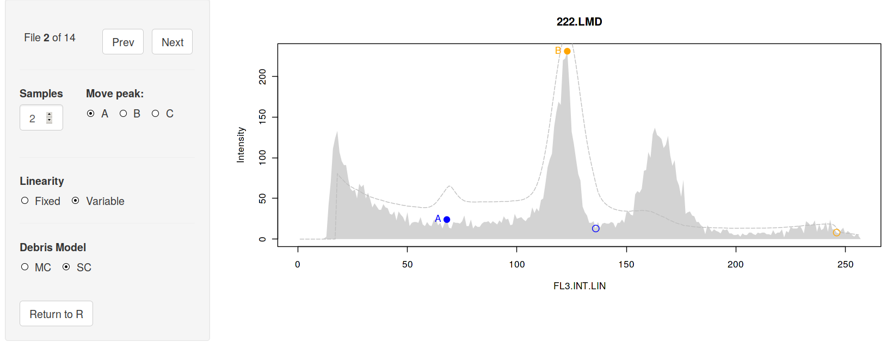
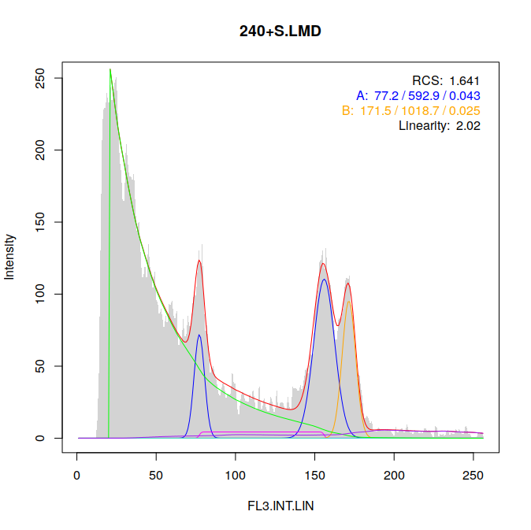

# Overview

`flowPloidy` uses the [Shiny](shiny.rstudio.com) framework to provide an interface for viewing histograms. The main purpose of this interface is to allow users a simple, quick way to confirm that the fitted models are sensible, and to correct the most common problem: misidentified peaks.

# Preliminaries 

First, we need a list of `flowHist` objects. The easiest way to get one is via the `histBatch()` function. There are two required arguments:

files

: a vector of file names (character)

channel

: a string (character) indicating the data channel to read

The following optional arguments may also be used:

bins

: the number of bins to group the data into (default: 256)

verbose

: boolean, if `TRUE` (the default) report the filenames as they are processed. Useful for debugging, or tracking progress on long-running jobs

window

: numeric, the size of the moving window used to identify local peaks (default: 20)

smooth

: numeric, the size of the moving window used to reduce noise in the histogram during peak detection (default: 20)

If you have clean, narrow peaks, you may want to lower the values of `window` and `smooth`, say to 16 and 8 respectively. Don't worry about finding perfect values, the point of the interface is to allow for quick and painless correction of peak detection.

To get a list of file names, the R function `list.files()` is very useful. It returns a vector of all the files in a directory:

```{r list-files, eval = FALSE}
my.files <- list.files("inst/extdata/")
## [1] "188-15.LMD"      "222.LMD"         "226.LMD"
## [4] "240-4-2+rad.LMD" "notes.txt"       "248+r.LMD"      
## ...
```

If there are a mix of files in the directory, you can specify a pattern to match to ensure you only get the FCS files:

```{r list-files2, eval = FALSE}
my.files <- list.files("inst/extdata/", pattern = ".LMD$")
## [1] "188-15.LMD"      "222.LMD"         "226.LMD"
## [4] "240-4-2+rad.LMD" "240+S.LMD"       "248+r.LMD"      
## ...
```

```{r, eval = FALSE, echo = FALSE}
## Can't run this code for in the vignette, but it's what you need
## if you actually want to run this interactively: 
my.files <- list.files(system.file("extdata/", package = "flowPloidy",
                                   pattern = "*.LMD", full.names = TRUE))
```

Armed with a list of file names, we can now process them:

```{r histBatch, eval = FALSE}
batch1 <- histBatch(my.files, channel = "FL3.INT.LIN")
```

# flowShiny

Now we're ready to review our analyses. If you want to overwrite the original analyses with the corrected values, assign the output of `flowShiny()` to the original variable. If you want to keep the automatic analyses separate (if you want to compare them later to your corrections), you can use a new variable to store the results.

```{r flowShiny, eval = FALSE}
batch1 <- flowShiny(batch1)
## to keep the intermediate results, instead use:
## batch1_corrected <- flowShiny(batch1)
```

**IMPORTANT** remember to assign `flowShiny(batch1)` to a variable. If you don't, all of the corrections you make will be discarded when you close the app.

At this point, R should respond with:

```
Listening on http://127.0.0.1:3459
```

and your web browser will open to display something like this:


(You may need to maximize your browser window for the layout to look 'correct'. I'm still working on this.)

In the upper-left corner you will find the navigation. Click on 'Next' and 'Previous' to move forwards and backwards over your list of files. Note the counter - you can't move past the first or last files of course.

Now take a look at the histogram. A number of features are displayed:

Peak A G1 estimate

: a thick vertical blue line with a label at the top indicates the estimated position of the first ('A') G1 peak. A blue circle indicates the actual position on the histogram used as the initial value.

Peak A G2 estimate

: a thin vertical blue line without a label indicates the estimated position of the G2 peak corresponding to the A G1 peak.

Peak B G1 and G2 estimates

: as for Peak A, but orange

Initial model estimate

: the thick, dotted black line indicates the initial parameters used for the model-fitting.

Fitted model components

: the coloured lines indicating the fitted components:

    - green: single-cut debris model
    - blue: sample A G1 and G2 peaks
    - orange: sample B G1 and G2 peaks
    - magenta: S-phase of sample A
    - turqoise: S-phase of sample B
    - red: the complete model
    
For the first histogram, file `188-15.LMD`, the model fit is quite good, so we don't need to worry about improving the initial parameters. In fact, the first 4 files all look fine. However, the fifth file, `240+S.LMD` is not good:



Here, the peak-finding algorithm has failed to distinguish among the two overlapping peaks around 162, and the smoothing has resulted in the first peak being misplaced near 70. We can reset either or both of the initial peak parameters. To do so:

1. Check the 'Move Peak' button for the peak you want to move
2. Click on the histogram where that peak should be
3. Wait a moment while the model fitting is updated

For example, if we move the A peak up to 76, the model-fitting is improved enough to clarify the distinction between the overlapping peaks, even without correcting the B peak:


You can move the B peak around as well, to convince yourself that the fitting isn't improved even with a better initial estimate.

Continue on to file 7, `337.LMD`. Here, the model fit is actually not too bad, but the G1 peak of sample A has been erroneously assigned to noise in the debris field:


If we leave this uncorrected, the data summary will show the G1 peak with a size of 0, and the G2 peak being quite large. To fix this, move the A peak over:


Let's take a look at one more. File 12, `734.LMD` has a bad fit:


The data is good, with nice clean peaks. However, the default `window` and `smooth` parameters are set to deal with noisier, broader peaks. We could fix this by repeating the analysis with new settings, but that would likely break the analysis of some of the other files. So instead, we reset the A peak to a better value:



When you're done, click on `Return to R` to get back to the command line. (You can close the browser window **after** you click this, **not before**). Now all you're corrected analyses will be stored in the variable you passed the results of `flowShiny()` to. You can check this with:

```{r flowShiny-output, eval = FALSE}
plot(batch1[["734.LMD"]])
```


We have the corrected model fits, so we can export the data for further analysis:

```{r flowShiny-export, eval = FALSE}
exportFlowHist(batch1)
## To save to a file:
## exportFlowHist(batch1, file = "data-out.csv")
```
