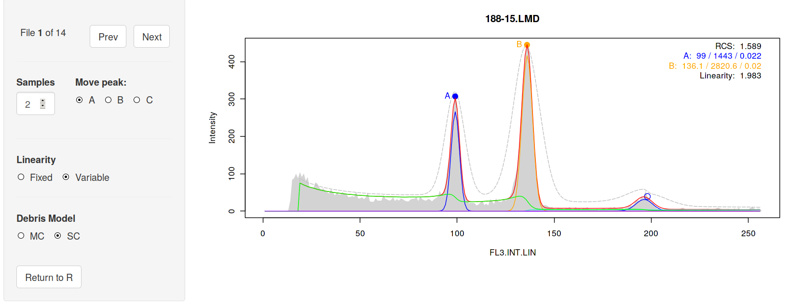
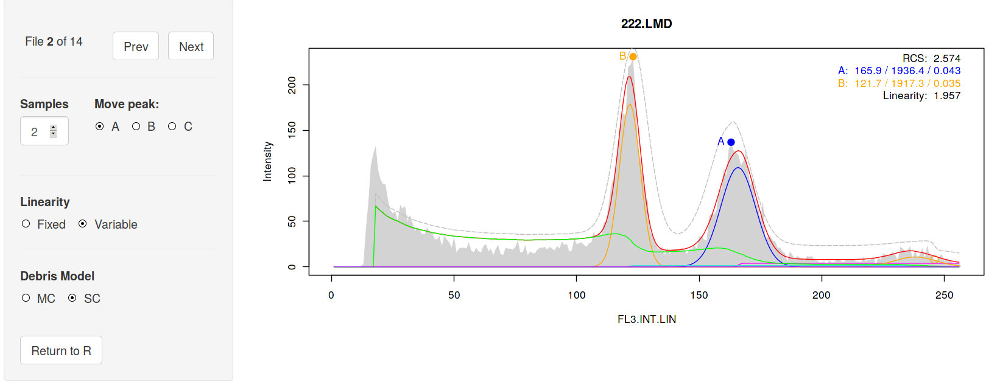
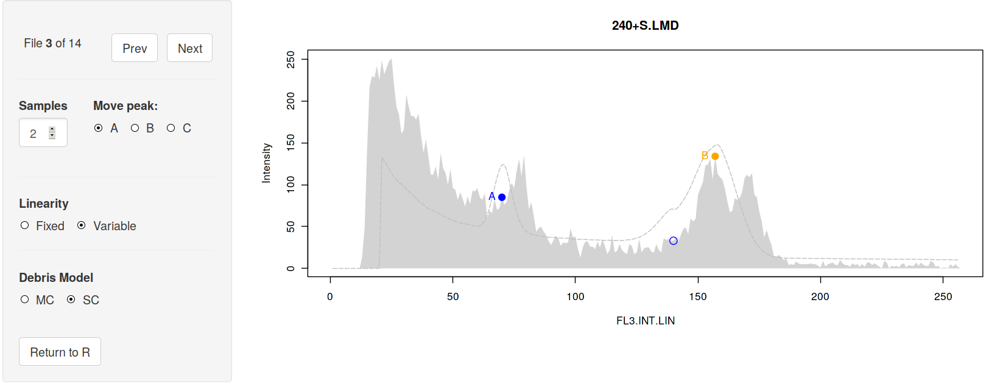
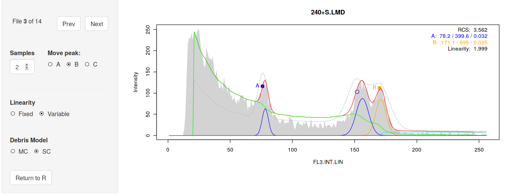
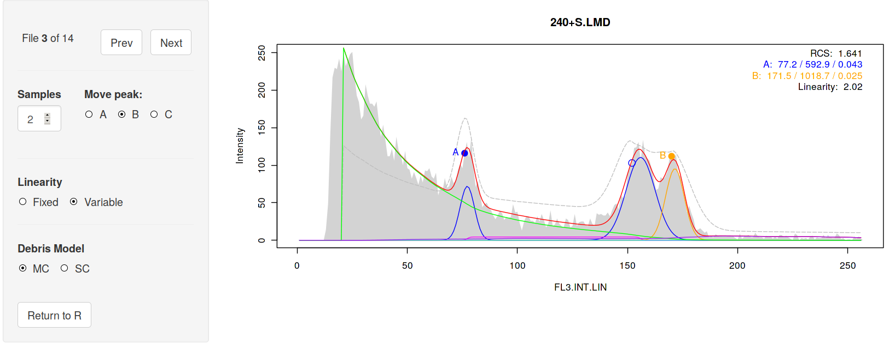

# Installation

> **NOTE** `flowPloidy` will eventually be available in the
> [Bioconductor](bioconductor.org) repository. Until then, there are some
> minor hurdles to clear to get the necessary packages installed from
> various locations on the web. You only need to install these packages
> once. Afterwards, you just need to load them with
> `library(package-name)`.

## `flowCore`
`flowPloidy` depends on the Bioconductor package `flowCore`. You will have 
to install this dependency before we get started (this requires an
internet connection):

```{r, eval=FALSE}
source("https://bioconductor.org/biocLite.R")
biocLite()
biocLite("flowCore")
```

## `devtools`

In order to install packages directly from the repositories where they are
developed, you need the `devtools` package:

```{r, eval = FALSE}
install.packages("devtools", dependencies = TRUE)
library("devtools")
```

## `flowPloidyData`

The files we use in the vignettes and examples are provided in the
`flowPloidyData` package:

```{r, eval = FALSE}
install_github("plantarum/flowPloidyData")
```

## `flowPloidy`
`flowPloidy` is currently available
from [BitBucket](https://bitbucket.org/tws/flowPloidy):

```{r, eval = FALSE}
install_bitbucket("tws/flowPloidy")
```

If you run into any errors, look for messages reporting missing packages,
and install these. One that sometimes needs to be installed separately is
`codetools`:

```{r, eval = FALSE}
install.packages("codetools", dependencies = TRUE)
```

# Preliminaries

## Sample Data Files

Once our packages are installed, we only need to load them into memory to
use them: 

```{r}
library(flowPloidy)
library(flowPloidyData)
```

The `flowPloidyData` package provides a single variable, `flowPloidyFiles`.
This is a vector of file names that points to the sample FCS files in your
R installation that we will use in this vignette. The actual path to the
files will differ slightly on different computers, and on different
operating systems; R takes care of those details for us.

## Data Channel

You will need to know which channel to use for your analysis. This will
most likely remain the same for all analyses from the same flow cytometer.
We can use the `viewFlowChannels` function to see the options:

```{r, output = "hold"}
viewFlowChannels(flowPloidyFiles[1])
```

Hopefully you see something there that corresponds to the channel you're
interested in. In our case, it's "`FL3.INT.LIN`". 

# Simple Analysis

With all the necessary packages installed, and the name of the channel of
interest identified, we are ready to proceed with a `flowPloidy` analysis.

```{r}
fh1 <- FlowHist(file = flowPloidyFiles[1], channel = "FL3.INT.LIN")
```

Now that we have our data loaded, `plot` will display it for us:

```{r simplePlot, fig.cap = "FCS Histogram"}
plot(fh1)
```

During the loading process, `flowPloidy` attempts to locate cell
populations and identify initial values for model fitting. You can see this
by setting the `init = TRUE` argument in the `plot` function:

```{r initialValues, fig.cap = "Histogram with Initial Values"}
plot(fh1, init = TRUE)
```

A number of features are displayed on the histogram:

Peak A G1 estimate

: a thick vertical blue line with a label at the top indicates the
estimated position of the first ('A') G1 peak. A blue circle indicates the
actual position on the histogram used as the initial value.

Peak A G2 estimate

: a thin vertical blue line without a label indicates the estimated
position of the G2 peak corresponding to the A G1 peak.

Peak B G1 and G2 estimates

: as for Peak A, but orange

Initial model estimate

: the thick, dotted black line indicates the initial parameters used for
the model-fitting.

The initial estimate is rough, but in this case it's close enough for the
model-fitting routines to find a solution, so we can immediately proceed to
the complete analysis.

```{r}
fh1 <- fhAnalyze(fh1)
```

Note that I have assigned the output of `fhAnalyze()` to the original
`flowHist` object `fh1`. The output of the analysis is stored in a new slot
in the `fh1` object -- all the original data remains unaltered in that
object.

Now that `fh1` contains a fitted model, the results will be displayed when
we call `plot` again:

```{r simpleAnalysis, fig.cap = "Histogram with Fitted Model"}
plot(fh1)
```

The plot has been updated to include the fitted model components in
different colours:

- green: single-cut debris model
- blue: sample A G1 and G2 peaks
- orange: sample B G1 and G2 peaks
- magenta: S-phase of sample A
- turqoise: S-phase of sample B
- red: the complete model

We can see that the coarse initial estimates were indeed close enough to
give us an acceptable model fitting. The numerical results are now
available by printing the `FlowHist` object:

```{r, output = "hold"}
fh1
```

Here we see the ratio between the peaks with the standard error of the
ratio, and a table of peak data: nuclei counts (i.e., the number of nuclei
modelled in the G1 peaks), peak size, the coefficient of variation for the
peak, and the Reduced Chi-Square value (RCS) recommended by @bagwell_1993
as an objective assessment of model fit (but see @rabinovitch_1994 for a
contrasting view).

# Manually Selecting Starting Values

Sometimes, particularly with noisy histograms, `flowPloidy` will not
produce useful starting values:

```{r noisyData, fig.cap = "Histogram with Bad Initial Values"}
fh2 <- FlowHist(file = flowPloidyFiles[12], channel = "FL3.INT.LIN")
plot(fh2, init = TRUE)
```
Here we can see that high spike around bin 50 was ignored, resulting in
both the A and B peaks being placed together near bin 136. We can manually
set the appropriate starting values with `pickInit`: 

```{r, eval = FALSE}
fh2 <- pickInit(fh2)
```

`flowHist` will prompt you to click on the peaks of the first and second
peak manually, adding a circle to the plot at each point.

```{r fakingInteraction, echo = FALSE, fig.cap = "Histogram with Manually Selected Peaks"}
## This stuff is automatically done by the interactive function pickInit,
## which we can't actually use in the automated vignette.
fh2 <- flowPloidy:::resetFlowHist(fh2)
fh2@peaks <- structure(c(50.2623811329645, 139.061074258603,
                         258.242164238835, 178.771283080744),
                       .Dim = c(2L, 2L),
                       .Dimnames = list(NULL, c("mean", "height")))

fh2 <- flowPloidy:::addComponents(fh2)
fh2 <- flowPloidy:::makeModel(fh2)
fh2 <- flowPloidy:::getInit(fh2)

plot(fh2)
points(fh2@init$Ma, 255, col = 2, cex = 3)
points(fh2@init$Mb, 175, col = 3, cex = 3)
```

The new peak values are used to recalculate the initial values:

```{r initPick, fig.cap = "Histogram with Corrected Initial Values"}
plot(fh2, init = TRUE)
```

Now we are ready for the analysis:

```{r correctedAnalysis, fig.cap = "Histogram with Fitted Model"}
fh2 <- fhAnalyze(fh2)
plot(fh2)
fh2
```

# Exporting Results

To summarize the results in a data table, use the `tabulateFlowHist`
command: 

```{r}
tabulateFlowHist(fh1)
```

To combine multiple objects in a single summary, combine them as a list:

```{r}
tabulateFlowHist(list(fh1, fh2))
```

As a convenience, if you pass a file name to the `file` argument of
`exportFlowHist`, the table will be saved to that file:

```{r, eval = FALSE}
tabulateFlowHist(list(fh1, fh2), file = "flow-results.csv")
```

# Processing Directories with `batchFlowHist`

## Generating a file list in R

If you have a large number of files to process, `flowHist` can read them
all in together. The `batchFlowHist` function provides this feature. To use
it, you need a list of file names to process. The R function `list.files()`
is helpful here. If your FCS files are in the directory "`datadir/`", you
can collect all their names using:

```{r, eval = FALSE}
my.files <- list.files("datadir/", full.names = TRUE)
```

If you have a mix of FCS files and other files together, you can supply a
pattern to match only your data:

```{r, eval = FALSE}
my.files <- list.files("datadir/", pattern = ".LMD", full.names = TRUE)
```

If you want to combine directories, use `c()`:

```{r, eval = FALSE}
my.files <- list.files("datadir1/", full.names = TRUE)
my.files <- c(my.files, list.files("datadir2/", full.names = TRUE))
```

For this example, I'll continue to use the sample data included with
`flowPloidyData`. Here, we'll use all of them (i.e., `flowPloidyFiles`),
not just one (e.g. `flowPloidyFiles[1]`).

## Using `batchFlowHist`

The `batchFlowHist()` function has two required arguments:

files

: a vector of file names (character), such as we generated in the previous
section.

channel

: a string (character) indicating the data channel to read, which we
discovered using the function `viewFlowChannels()` above.

The following optional arguments may also be used:

bins

: the number of bins to group the data into (default: 256)

verbose

: boolean, if `TRUE` (the default) report the filenames as they are
processed. Useful for debugging, or tracking progress on long-running jobs

window

: numeric, the size of the moving window used to identify local peaks
(default: 20)

smooth

: numeric, the size of the moving window used to reduce noise in the
histogram during peak detection (default: 20)

If you have clean, narrow peaks, you may want to lower the values of
`window` and `smooth`, say to 16 and 8 respectively. Don't worry about
finding perfect values, the point of the interface is to allow for quick
and painless correction of peak detection.

```{r histBatch}
batch1 <- batchFlowHist(flowPloidyFiles, channel = "FL3.INT.LIN")
```

You can export the results with `tabulateFlowHist()`:

```{r}
tabulateFlowHist(batch1)
```

You can scroll through the resulting plots with the following code:

```{r, eval = FALSE}
parOld <- par(ask = TRUE)
lapply(batch1, FUN = plot)
## press enter to scroll through your files!
par(parOld)
```

However, that's a bit tedious if you need to tweak the parameters for any
of the individual `FlowHist` datasets in the list. A more covenient
approach is provided by the `browseFlowHist` function, described in the
next section.

# `browseFlowHist`

`browseFlowHist` uses the [Shiny](shiny.rstudio.com) framework to provide
an interface for viewing histograms. The main purpose of this interface is
to allow users a simple, quick way to confirm that the fitted models are
sensible, and to correct the most common problem: misidentified peaks that
lead to bad starting parameters.

To use `browseFlowHist`, pass it the list of `FlowHist` objects we created
with `batchFlowHist` above:

```{r browseFlowHist, eval = FALSE}
batch1 <- browseFlowHist(batch1)
```

**IMPORTANT** remember to assign `browseFlowHist(batch1)` to a variable. If
you don't, all of the corrections you make will be discarded when you close
the app. If you want to keep the original values, assign it to a new
variable, i.e., `batch1_corrected <- browseFlowHist(batch1)`.

At this point, R should respond with:

```
Listening on http://127.0.0.1:3459
```

and your web browser will open to display something like this:



(You may need to maximize your browser window for the layout to look
'correct'. I'm still working on this.)

In the upper-left corner you will find the navigation. Click on 'Next' and
'Previous' to move forwards and backwards over your list of files. Note the
counter - you can't move past the first or last files, of course.

For the first histogram, file `188-15.LMD`, the model fit is quite good, so
we don't need to worry about improving the initial parameters. In fact, the
first 4 files all look fine. However, the fifth file, `240+S.LMD` is not
good:


Here, the peak-finding algorithm has failed to distinguish among the two
overlapping peaks around 162, and the smoothing has resulted in the first
peak being misplaced near 70. We can reset either or both of the initial
peak parameters. To do so:

1. Check the 'Move Peak' button for the peak you want to move
2. Click on the histogram where that peak should be
3. Wait a moment while the model fitting is updated

For example, if we move the A peak up to 76, the model-fitting is improved
enough to clarify the distinction between the overlapping peaks, even
without correcting the B peak:



You can move the B peak around as well, to convince yourself that the
fitting isn't improved even with a better initial estimate.

Continue on to file 8, `337.LMD`. Here, the model fit is actually not too
bad, but the G1 peak of sample A has been erroneously assigned to noise in
the debris field:



If we leave this uncorrected, the data summary will show the G1 peak with a
size of 0, and the G2 peak being quite large. To fix this, move the A peak
over:



Let's take a look at one more. File 12, `734.LMD` has a bad fit:



The data is good, with nice clean peaks. However, the default `window` and
`smooth` parameters are set to deal with noisier, broader peaks. We could
fix this by repeating the analysis with new settings, but that would likely
break the analysis of some of the other files. So instead, we reset the A
peak to a better value:


When you're done, click on `Return to R` to get back to the command line.
(You can close the browser window **after** you click this, **not
before**). Now all you're corrected analyses will be stored in the variable
you passed the results of `flowShiny()` to. You can check this with:

```{r flowShiny-output, eval = FALSE}
plot(batch1[["734.LMD"]])
```


We have the corrected model fits, so we can export the data for further
analysis:

```{r flowShiny-export, eval = FALSE}
tabulateFlowHist(batch1)
```

Remember, if you don't pass a `file` argument to `tabulateFlowHist` it only
prints the results to he screen, they aren't saved in a file (which file
could it be?). To save the results of your analysis to disk, use:

```{r, eval = FALSE}
tabulateFlowHist(batch1, file = "my-analysis-output.csv")
```

# References
